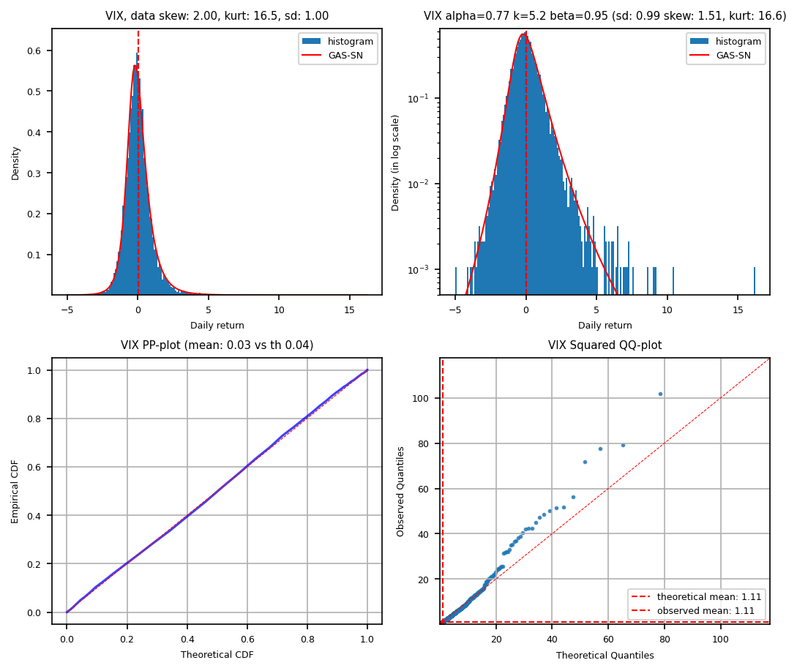
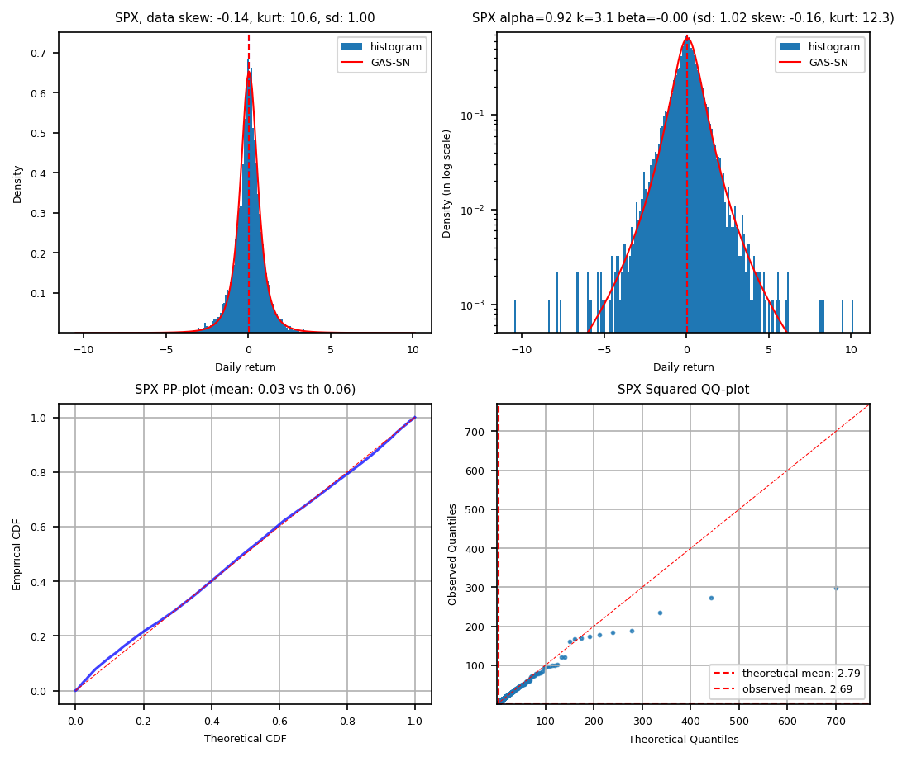
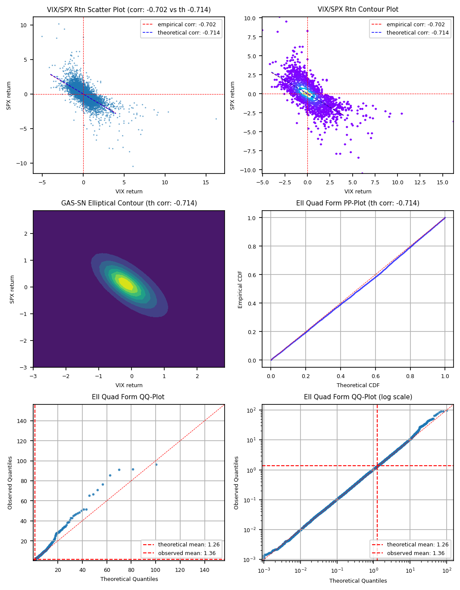

# gas-impl
# GAS-SN: generalized alpha-stable distribution with skew-normal family

## Overview - Fractional Distributions

This package is upgraded to incorporate the skew-normal family in 2025, called GAS-SN. 
The GAS-SN distribution is the most flexible distribution up to date, that can fit data sets with high skewness and kurtosis.

The content is written in a book format, located at [here](docs/fracdist.pdf).
As of April 2025, the book is in early draft format. More detail will be filled in.

This package provides the reference implementation for all the distributions mentioned in the book.
See the test cases for usage examples. Every function is tested in at least one test cases.

In late 2025, I have decided to call this group of new distribution **The Fractional Distributions**:
<table>
<tr>
<th> classic distribution </th><th> fractional distribution </th>
<td> generalized gamma distribution </td><td> fractional gamma distribution (chapter 6)</td>
<td> chi/chi2 distribution </td><td> fractional chi/chi2 distribution (Chapter 7)</td>
<td> F distribution </td><td> fractional F distribution (Chapter 8)</td>
<td> univariate skew-t distribution </td><td> univariate GAS-SN distribution (chapter 12)</td>
<td> multivariate skew-t distribution </td><td> multivariate elliptical GAS-SN distribution (Chapter 15)</td>
<tr>
</table>

To showcase how good the fits are, two univariate fits on VIX and SPX return distributions are presented below:
<table>
<tr>
<td>  </td>
<td>  </td>
<tr>
</table>

The bivariate VIX-SPX data set is fitted with the bivariate elliptical distribution, as shown below:




My previous 2024 paper that laid the foundation is located at

https://arxiv.org/abs/2405.04693


## Installation

There is no plan to set up pypi yet. 

Please use the github local installation method:

```bash
pip install git+https://github.com/slihn/gas-impl.git#egg=gas_impl
```

If the above method doesn't work, a safer method is to 'git clone' this repository in a local directory. 
Then run:

```bash
cd /path-to/gas-impl
pip install -e .
```

You can run the test cases to make sure everything is working in your platform:

```bash
cd /path-to/gas-impl
pytest
```

This package is developed under linux/ubuntu.
The 'pandarallel' package is used for multicore processing when an array is sent to the 'pdf' or 'cdf' functions.
This part of implementation may not work for a non-linux platform. Please be aware.

## Example

Once you have installed the package, you can run the following snippets:

```python
from gas_impl.stats import gsas

g = gsas(alpha=1.1, k=2.5)
g.pdf(0.25)
```

The answer should be 0.32678...

Add skewness with the beta parameter:

```python
from gas_impl.stats import gas_sn

g = gas_sn(alpha=1.1, k=2.5, beta=0.5)
g.pdf(0.25)
```

The answer should be 0.35881...
